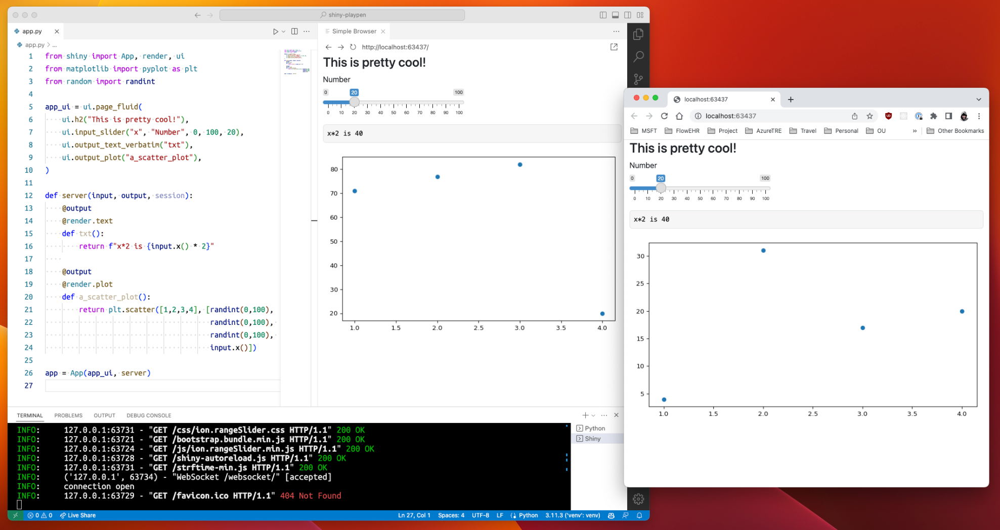

# Shiny for Python Playpen

A very basic app to play with Shiny for Python.



## Getting Started

```bash
python3 -m venv venv
source venv/bin/activate
pip install -r requirements.txt
shiny run --reload
```

## More Infomation

<https://shiny.posit.co/py/>
